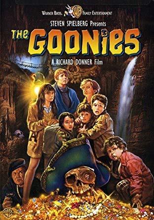

# My Favorite 5 Movies 

# About
This is a description of my all time favorite movies that I have seen, while also giving some information about those said movies. This all will culminate in my overall thoughts on the said movies. 
# How each section will be organized  
- Background info
- Reasons why they are in the position
- Favorite quote
# 5. Finding Nemo
- The movie [*Finding Nemo*](https://www.imdb.com/title/tt0266543/) was created on May 30, 2003 by Disney and Pixar Animation. The movie is about a clown fish fathre looking for his son who was taken by a person. On this adventure he meets a quirky companion who cannot remember anything after hearing it. This leads to many unique situations that the charactersa havew to go through in order to get his son back.
- **Reason why I enjoy the movie**
1. This movies combines both childish humor while also appealing towards the older audience watching.
2. The adventure of an over protective parental figure is an aspect of the movie that many people can connect to.
3. The fears that Marlin may feel and having to overcome that feelin
-  > "Fish are friends, not food"
# 4. Avengers
- [The Avengers](https://www.imdb.com/title/tt0848228/) is the movie that started an entire cinematic universe that is world reknowned today. The movie is about key members from Marvel comics working together to protect the world from an invading force of aliens led by the Norse God Loki. The Avengers consisted of Thor, the God of Thunder, Ironman, Captain America, The Hulk, Blackwidow, and Hawkeye. They must do battle with Loki, his army given to him by Thanos and themselves during the movie with some moments that add drama to every action done by the characters
- **Reasons why I enjoyed Avengers**
1. This movie was the start of the marvel cinematic universe because it showed that the combination of comic book characters could result in a movie that 
2. This movie helped to break the trend of comic book movies failing by having well-knowned actors play the characters.
3. With all the details that were included that foreshadowed the future of the cinematic universe shwoing that the director that created this movie understood that the audience of the movie shall enjoy it so much that there will be demands for more.
> "Puny God"
# 3. Kill Bill: Vol. 1
- [*Kill Bill: Vol. 1*](https://www.imdb.com/title/tt0266697/) is the story of a unknown pregnant woman who was nearly killed during her wedding. She was trying to escape a group of assassins led by the man Bill, but Bill and the group were enraged that she left and killed her as a result. This entire movie is spent with her finding and killing everyone who was involved in trying to kill her and killed  her fiance after she woke up from a coma with no child.
- **Reasons why I enjoyed Kill Bill Vol. 1**
1. Through the use of random sound, whenever the wife says her name some sound plays so that the audience never figures out her name.
2. The use of many cinematic tools that Tarentino movies commonly use, show the importance of every scene because there is a deeper meaning behind even the scenes that many view as pointless.
3. This is the first movie that Tarnetino directed thart had violence that was actually shown on the screen because the importance of the violence to the progression of the plot of the story
>  "To get even? Even Steven? I have to kill you..."
# 2.Avatar
- [Avatar](https://www.imdb.com/title/tt0499549/) is the story of humans finding a land that is home to an alien race. This land has a metal substance present in the world that the humans wanted. This led to warbetween the humans and the alien and one of the humans uses a clone of an alien joined the side of the alien to fight for their freedom.
- **Reasons I like Avatar**
1. It tackled real world topics in a effective way that did not seem to ridicule the people of the world, som much as to inform.
2. The use of CGI was so effective that the characters present in movie who were made of the images seemed to be other worldly.
3. The actors present in the movie conveyed the emotions of many that would be expected so much so that it did not appear as if they were acting.
> "No. No. To get even? Even-Steven? I would have to kill you, go up to Nikki's room, kill her, then wait for your husband, the good Doctor Bell, to come home and kill him. That would be even, Verntia. That'd be about square."
# 1. The Goonies 

- [The Goonies](https://www.imdb.com/title/tt0089218/) is a movie about a group of misfit kids who are about to lose tyheir homes due to forclosure if they do not pay a certain amount of money by the end of the day. The kids find a treasure map that leads to the ship of the famous pirate, One Eyed Willy. After searching around they run into a group of criminals looking for the treasure too and the drama of the movie starts. This results in the group who call themselves the Goonies to run into many weird and unquie situations.
- **Reasons why I like the Goonies**
1. The main characters of the movie are a froup of outcast kids that are not that popular or special, but by working together accomplish things that even the smartest of adults couldn't.
2. Uses a mix of comedy and drama to create scences that are both suppensful and full of comedy.
3. The antaginist of the movies are not the most inteligent of people, but they are still an imposing threat in the world to the children.
> "Hey you guys!!!!" and "I'm gonna hit you so hard that when you wake up your clothes will be out of style.

